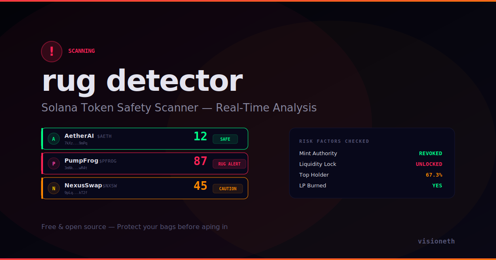

# Rug Pull Detector

**Real-time Solana token safety scanner. Analyzes new launches and scores rug pull risk.**

[**Live Demo**](https://visioneth.github.io/rug-pull-detector/)



## What It Checks

| Factor | Weight | Green | Red |
|--------|--------|-------|-----|
| **Mint Authority** | 25% | Revoked | Active (can mint infinite tokens) |
| **Liquidity Lock** | 20% | Locked | Unlocked (devs can pull LP) |
| **Freeze Authority** | 15% | Revoked | Active (can freeze your tokens) |
| **Top Holder %** | 15% | < 20% | > 50% (whale can dump) |
| **LP Burn** | 10% | Burned | Not burned |
| **Holder Count** | 10% | > 500 | < 100 (low distribution) |
| **Contract Verified** | 5% | Yes | No |

## Risk Levels

- **0-29** — SAFE (green)
- **30-49** — CAUTION (orange)
- **50-74** — DANGER (red)
- **75-100** — RUG ALERT (flashing red)

## Features

- **Live token scanning** with animated feed
- **Risk score visualization** with color-coded bars
- **Risk breakdown panel** showing each factor
- **Recent rugs feed** tracking confirmed rug pulls
- **Radar sweep animation** + floating threat particles
- **Click any token** to see full risk detail

## Tech

- Pure HTML/CSS/JS — no build step
- Simulated token feed with realistic risk distributions
- Radar sweep, scan lines, threat particles for visual appeal

## Run Locally

```bash
git clone https://github.com/visioneth/rug-pull-detector.git
cd rug-pull-detector/docs
open index.html
```

## License

MIT — [visioneth](https://github.com/visioneth)
